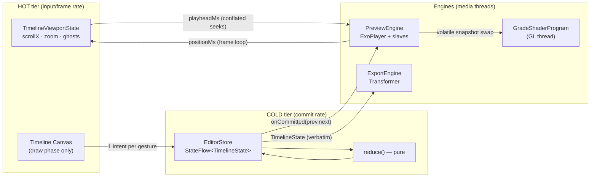

# Kinetic — Native Android Video Editor Blueprint

A production-grade architecture and working code skeleton for a CapCut-class,
hardware-accelerated multi-track video editor built on **Jetpack Compose +
Media3 (ExoPlayer / Transformer / GL effects) + Kotlin Coroutines/StateFlow**
under a strict MVI contract.

## Build and run

```bash
cd kinetic-editor
./gradlew :app:installDebug      # or open the folder in Android Studio and Run
./gradlew :app:testDebugUnitTest # 59 pure-JVM logic tests
python3 tools/check-shaders.py   # compiles the GLSL (needs glslang-tools)
```

The Gradle wrapper, launcher icon, theme, ProGuard rules and the film LUT asset
are all committed, so a fresh clone builds and installs with no extra setup.
Code targets **media3 1.8.0** (see [API drift notes](#api-drift-notes)).

**Verification status.** Google's Maven was unreachable from the authoring
environment, so the app has not been assembled by Gradle there. Instead:

- Every file outside the Compose UI — the engines, the GL effects, the
  compositor, the export mapper and worker, the audio processors, the probe,
  the view model — **compiles with the real Kotlin 2.1.0 compiler against the
  media3 1.8.0 sources** (the `androidx/media` tag, loaded as Java source roots)
  and the Android 15 framework classes, with the kotlinx-serialization compiler
  plugin. ExoPlayer, Transformer, `VideoCompositorSettings`, `OverlaySettings`,
  `BaseGlShaderProgram` and friends are type-checked call sites, not reviewed
  ones. (This is what caught `OverlaySettings`/`VideoCompositorSettings` having
  moved to `androidx.media3.common`, and the deprecated composition-level
  `experimentalSetForceAudioTrack`.)
- The Compose UI (`EditorScreen`, `PreviewSurface`, `ui/timeline/*`,
  `MainActivity`) **compiles against Compose Multiplatform's desktop artifacts**
  — the same `androidx.compose.*` API surface, published to Maven Central —
  with the Compose compiler plugin, in a small Gradle JVM project that adds the
  android-all jar, the media3 sources and stubs for the handful of Android-only
  pieces (`AndroidView`, `LocalContext`, activity results, WorkManager,
  ViewModel). The whole tree type-checks clean. (This is what caught an
  undefined name and a missing import in `EditorScreen`.)
- **The GLSL is compiled**, by the Khronos reference compiler, as the ESSL 1.00
  a GLES driver reads it as — both stages, and both sides of the precision
  guard. `tools/check-shaders.py` then reflects each linked program and checks
  it against the Kotlin class that drives it — the grade shader and the three
  canvas-fill passes: every uniform a class writes must exist in the program
  it builds, with a matching type. That is not
  pedantry — drivers strip uniforms nothing reads, and `GlProgram` *throws*
  when asked to set a missing one, so a uniform renamed on one side only is a
  crash on the first frame of every device. The checker was proved by breaking
  the shader on purpose: it catches both a renamed uniform and a syntax error.
- The pure-logic core (models, reducer, undo store, timeline<->preview mapping,
  shared transition/sequence/PiP planning math, project codec, timeline
  geometry) runs on the JVM: the 72 tests in `app/src/test` pass under JUnit
  4.13.2, alongside a 58-scenario executable sandbox suite. The harness
  compiles the tests against the real effect classes with only the GL calls
  stubbed out, which is what caught two test call sites that had drifted
  from the constructors they call.

---

## 1. Architecture: three tiers, two temperatures

The defining problem of a mobile video editor is that three worlds run at
different frequencies and NONE of them may block another:

| World | Frequency | Owner |
|---|---|---|
| Gestures & drawing | 60–120 Hz | Compose (main thread, draw phase) |
| Document mutations | ~1–10 Hz (gesture commits) | MVI store (main thread) |
| Decode / GL / encode | frame rate of media | Media3 internal threads |



### The two-temperature state model (why the UI never stutters)

- **Cold state** — `TimelineState` (tracks → clips → trims/speed/effects) is an
  immutable persistent-collection document inside `EditorStore`. It changes only
  when a gesture **commits** (finger up) or a slider emits a coalesced intent.
  Undo/redo is a stack of these snapshots — structural sharing makes 100 levels
  cost kilobytes (`core/mvi/EditorStore.kt`).
- **Hot state** — scroll, zoom, in-progress trim/drag ghosts live in
  `TimelineViewportState` as Compose snapshot state, read **only in the draw
  phase and pointer handlers**. Scrubbing at 120 Hz mutates two floats and
  re-executes one draw lambda; composition and layout are skipped entirely
  (`ui/timeline/TimelineViewportState.kt`).

A gesture previews its result by merging a *ghost* into the drawn track
(`effectiveTrack()` in `TimelineCanvas.kt` — live ripple included) and dispatches
**exactly one intent** on release. The store is never hammered at input rate.

### Commit routing (the decoupling contract)

`EditorViewModel.route()` grades every commit by how much of the media pipeline
must actually move:

| Change class | Detector | Action | Cost |
|---|---|---|---|
| Cosmetic (grade/LUT/transition/volume/speed/text) | always | volatile FX + segment snapshot swap | ~µs |
| Audio / PiP structure | `audioStructureHash()`, `overlayStructureHash()` | rebuild slave playlists | ms, rare |

The line between the first two rows is load-bearing in both directions. A PiP's
placement is deliberately *absent* from `overlayStructureHash`, so dragging its
size or position does not tear down and re-prepare the PiP player sixty times a
second — but the preview still has to follow, so `publishOverlays` runs on the
cosmetic path too and re-emits the placement windows the UI lays its boxes out
from. Handles are values, so a commit that touches no placement produces an
equal list and the flow stays silent. A unit test pins both halves.
| Video structure (trim/reorder/add/remove) | `videoStructureHash()` | rebuild `ConcatenatingMediaSource2`, position-preserving | ~100 ms, rare |

This is why dragging a saturation slider during playback re-renders every frame
with the new value *without touching the player pipeline*: the slider dispatches
coalesced `SetGrade` intents, the store commits, the engine swaps a
`@Volatile PreviewFxTimeline`, and the GL thread picks it up on the next
`drawFrame` — no locks anywhere (`effects/GradeEffects.kt`).

---

## 2. Fluid timeline (`ui/timeline/`)

**One `Canvas` node renders every track.** LazyRows were rejected deliberately:
per-frame item recomposition, entry/exit churn, and N scroll states to sync
during pinch-zoom. Instead:

- Five lanes: main video, PiP video, text, stickers, audio. An empty lane
  draws its own name, fixed in screen space rather than timeline space, so a
  blank project says what each row is for and the label never scrolls away from
  its lane or covers a clip.
- `TimelineGeometry` — pure time↔pixel math + manual hit-testing; reads the
  viewport *at call time* so it's only ever evaluated in draw/gesture phases.
- `TimelineCanvas` — ruler with adaptive tick density, filmstrip thumbnails,
  min/max waveforms, text/sticker chips, selection handles, playhead. New
  thumbnails invalidate **draw only** via a `mutableIntStateOf` revision read
  inside the draw lambda.
- `TimelineGestures` — one `pointerInput` arbitrates scrub-scroll (with decay
  fling), pinch zoom (playhead-anchored), frame-snapped trims, long-press
  drag-reorder with edge auto-scroll and magnetic snapping, and tap-select.
  On a clip body the long-press timer is **raced against the touch slop**
  (`awaitLongPressOrSlop`): move first and you scrub, hold still and you pick
  the clip up. Catching a moving (flung) timeline transfers position ownership
  without dropping a frame, and a gesture that ends where it started commits
  nothing — no phantom undo entries.
- The playhead is **fixed at center; content scrolls beneath it** (CapCut
  model), which makes `scrollX == playheadMs * pxPerMs` an invariant and gives
  playhead-anchored pinch zoom for free.
- Thumbnails (`engine/ThumbnailEngine.kt`): LRU byte-budgeted to heap/6, 1s
  source buckets, pooled `MediaMetadataRetriever` per URI (seek-open cost
  dominates), `OPTION_CLOSEST_SYNC` decode at 256×160. `peek()` is
  allocation-free for the draw loop; prefetch is driven by a `snapshotFlow` of
  the visible window bucketed to 64 px.
- Waveforms (`engine/WaveformEngine.kt`): one-time MediaCodec PCM decode into a
  normalized peak array (~50 buckets/s) on a dedicated single-thread lane.

## 3. Preview sync (`engine/PreviewEngine.kt`)

- The main track plays as **one `ConcatenatingMediaSource2`** (single seekable
  window) of `ClippingConfiguration`-trimmed items — ideal for scrubbing.
- **Two time domains, one mapper.** The window advances in *source* time; the
  editor thinks in *timeline* time (post-speed). `PreviewSegments` is the only
  place the conversion exists, both directions, binary-searched.
- **Frame accuracy:** `SeekParameters.EXACT` + scrubbing mode (media3 1.8) + a
  **one-deep conflated seek queue**: while a seek is in flight, new targets
  overwrite `pendingScrubMs`; `onRenderedFirstFrame` (the "frame actually hit
  the surface" signal) drains it. The decoder is never more than one seek
  behind the finger, regardless of input rate. A 250 ms watchdog covers
  audio-only edge cases.
- **Ownership, not polling**, syncs the scrubber: while playing, a
  `withFrameNanos` loop pushes player position → viewport; while the user (or
  their fling) owns the playhead, a `snapshotFlow` pushes viewport → conflated
  seeks. `isUserInteracting` breaks the feedback loop (`ui/EditorScreen.kt`).
- Per-clip speed and volume envelopes are applied by a 10 Hz control tick in
  preview (`setPlaybackSpeed`, `volume`) — the export applies them
  sample-exactly.
- **Effect timestamps are window positions by construction**
  (`engine/PreviewRenderers.kt`). Stock ExoPlayer hands the effects pipeline
  `bufferTime − startOfFirstStream`, captured once per renderer: sequential
  playback yields window positions, but a seek into another clip restarts the
  renderer clock, after which the same formula yields that clip's source time
  and the grade/LUT/transition lookups land on the wrong clip. A small
  `MediaCodecVideoRenderer` subclass derives the adjustment per stream from
  the period's position in the window instead, so the `PreviewFxTimeline`
  lookup is exact however playback got there.
- The preview is two nested frames, mirroring the export: the **canvas** (output
  size) holds the **picture** — the main clip letterboxed by its own display
  aspect, which is the fit the export's `Presentation` applies — so a landscape
  clip on a portrait canvas is never stretched. Text and stickers are placed
  relative to the canvas, PiP boxes relative to the picture, because that is
  what the composition-level overlay and the compositor respectively see.
- Overlay audio **and PiP video** tracks play on **slave ExoPlayers** phase-locked
  to the master (re-seek on >80 ms drift). A PiP gets its own `TextureView`
  (drawn in the view tree, so Compose can rotate, fade and clip it), laid out
  from the same `pipWindowAt` lookup the export compositor uses — resolved for
  the current playhead behind a `derivedStateOf`, so the box only re-lays out
  when a clip's framing actually changes. `PipSpec.scale` is the fraction of
  the picture's width; height follows the source's own proportions; between
  clips the box is hidden rather than left frozen on a stale frame.
- **The preview letterboxes with the export's own `Presentation`**, rather than
  approximating the fit in the view tree. What reaches the surface is already
  canvas-sized, so the surface *is* the canvas and every overlay — PiP boxes,
  text, stickers — is placed in canvas coordinates. The export matches by
  construction: `Presentation` runs on each main item *before* the compositor,
  so the compositor and the composition-level overlays work in that same space.
  Getting this wrong is subtle — position a PiP against the letterboxed picture
  in one pipeline and against the canvas in the other, and it lands in a
  different place in the render than on screen.
- A PiP is **graded by the same shader as everything else**: its player carries
  `GradeGlEffect` too, fed by a one-snapshot provider rather than a timeline,
  because a PiP has no transitions and its uniforms are therefore constant
  across a clip. The snapshot is swapped on `onMediaItemTransition` (immediate
  at a clip boundary, rather than waiting for the 10Hz tick) and on every
  cosmetic commit. The clip is chosen by the player's own item index — what the
  decoder is actually reading — not by the playhead.
- **Playback errors are surfaced, not swallowed.** A source that vanishes after
  being added (a persisted project whose file was deleted, a revoked URI) would
  otherwise be a silently black preview; `onPlayerError` on the master and every
  slave maps the error code to a plain sentence the UI shows, and the state
  clears when the pipeline is next rebuilt — which is what removing the bad clip
  does. Compositing both streams into one GL surface
  just to preview them would cost a full render pass per frame for no visual
  difference. Text/stickers preview as a Compose layer above everything, matching
  the export layer order (compositor first, `OverlayEffect` last).

## 4. Export (`engine/CompositionMapper.kt`, `engine/ExportEngine.kt`)

`TimelineState` → `Composition`, mechanically:

- Main track → primary `EditedMediaItemSequence`; per item: clipping trims,
  the **same GLSL grade/LUT/transition shader as preview** (windows computed in
  clip-local source time, placed *before* `SpeedChangeEffect`), then
  the speed change, then `VolumeEnvelopeAudioProcessor` (which runs in clip
  *timeline* time — same domain the keyframes are authored in). Transformer
  adds each item's sequence offset ahead of the item's own effects, so the
  export provider measures from the first frame it sees — the same trick
  media3's own `SpeedChangeEffect` uses — rather than trusting the timestamps
  to start at zero.
- Each **VIDEO_OVERLAY (PiP) track → its own video sequence**, positioned in
  time by gaps (blank frames) and in space by `PipCompositorSettings`, which
  resolves compositor input ids (0 = main track, 1..n = overlays) to the
  `PipWindow` in force at each frame's timestamp. The compositor's output is
  the primary frame itself — so the main picture is never cropped — and the
  overlay's scale is derived from the two frame sizes per composite, so
  `PipSpec.scale` means the same "fraction of the picture's width, own
  proportions kept" as in the preview. The sequence is padded with a trailing
  gap to the main track's end (media3's compositor otherwise keeps re-drawing
  a finished sequence's last frame), and outside a clip's window the overlay
  is drawn at alpha 0.
- Each AUDIO track → an audio-only sequence with `addGap()` silences. Every
  sequence sets its own `experimentalSetForceAudioTrack` (and the PiP ones
  `experimentalSetForceVideoTrack`): a sequence that opens with a gap, or with
  an item lacking a track that later items carry, fails the export without it.
- **Speed is media3's interlinked pair**, not two independent knobs.
  `SpeedChangeEffect` and a Sonic processor set to the same factor are two
  timestamp mappings with independent rounding, which is exactly what drifts
  audio against video over a long clip;
  `Effects.createExperimentalSpeedChangingEffect` returns a pair built to stay
  in sync. media3 documents the plain video effect as the choice "when input has
  no audio", so that is when the mapper uses it — a muted or silent clip, and
  audio-only sequences, which take the audio half alone.
- Overlay rotation is specified **counter-clockwise** by media3 and clockwise
  by Compose, so every preview rotation is negated against its export value.
  A preview that turns the opposite way from the render is worse than none.
- **Text animations are one implementation, seen twice.** `textAnimAt` is pure
  timing math in `core/model/Planning.kt`: given an animation, a time and the
  clip's window it returns alpha, scale, an anchor offset and a character count.
  The export's `TextOverlay` reads it per frame and the preview's Canvas draws
  from it, so an animation cannot look one way on screen and another in the
  file — and because it is pure, its timing is unit-tested, which is otherwise
  the kind of thing only a rendered video reveals. A clip shorter than the
  animation gets a *shorter* animation rather than a truncated one, so the two
  ends never overlap. Type-on pre-builds its prefixes at export start rather
  than allocating a string per frame on the GL thread.
- **Type faces are Android's own families, not bundled fonts.** `TextFont`
  carries the family name (`sans-serif`, `serif`, `monospace`, `cursive`) that
  the export resolves through `TypefaceSpan` *and* that Compose's built-in
  `FontFamily`s are themselves defined as — so preview and render pick the
  identical face rather than two that merely look similar. They also exist on
  every device and cost nothing to install. Bundled display faces would change
  nothing but that enum.
- TEXT/STICKER tracks → one composition-level `OverlayEffect` with
  alpha-gated, fade-edged windows (composition time == timeline time). Sticker
  scale is folded with the canvas width by `overlayScaleFor` — the one place
  that converts between "fraction of the frame", which is how the preview lays
  a box out, and "times the asset's native pixel size", which is how media3
  draws one. The picture-in-picture compositor uses it too, and a test holds
  the property that actually matters: an overlay is the same size on screen as
  it is in the render.
- Composition-level `Presentation.createForWidthAndHeight` fixes the canvas.
- `Transformer` + `DefaultEncoderFactory(VideoEncoderSettings(bitrate))` renders
  hardware-to-hardware; progress is polled into a cold `callbackFlow`;
  `ExportWorker` (WorkManager foreground job) surfaces notification + WorkInfo
  progress and survives the app being backgrounded.
- The render lands in app-private storage and is then copied into **MediaStore**
  (`Movies/Kinetic`), because a file inside the app sandbox is one the gallery
  and share sheet can never see. `IS_PENDING` hides it until the copy completes,
  and the sandbox copy is deleted once the shared one exists. No permission is
  needed from API 29; below that it fails soft and the file stays app-private,
  which the UI reports honestly rather than claiming a save that did not happen.

Decode → GL → encode never leaves GPU/codec surfaces, so 4K export memory is
flat by construction — no frame ever exists as a Java `Bitmap`.

## 5. What the editor can actually do

Every feature below is reachable from the UI, previewed live, and rendered by
the exporter — the model, the preview and the export path agree on all three.

| Area | Controls |
|---|---|
| Timeline | pinch zoom, momentum scrub, trim, split at playhead, drag-reorder, delete |
| Clips | speed presets (0.5–4x) and six **speed curves** (Montage, Hero, Bullet, Jump cut, Flash in, Flash out) on top of them; **freeze frame** at the playhead with an adjustable hold; per-clip brightness/contrast/saturation, film LUT toggle |
| Transitions | dip-to-black, wipe, zoom-punch on any clip boundary |
| Audio | music and voiceover lanes, per-clip volume, fade in/out, track mute |
| Text | editable content (multi-line), four type faces, bold, italic, eight colours, size, position, five entrance animations (cut, fade, pop, rise, type-on), and outline / shadow / backing box for legibility over footage |
| Stickers | seven shapes, swappable from the inspector, with size, position, rotation and the same animations text uses |
| Overlays | picture-in-picture (size, position, rotation, opacity) — every control is the number the export consumes |
| Looks | ten one-tap filters, plus brightness, contrast, saturation, warmth, **film grain** and **vignette** — a preset is a starting point rather than a mode, because it sets the same fields the sliders edit |
| Canvas | 9:16, 16:9, 1:1 and 4:5 presets, each fitted, filled (cropped) or stretched — applied by the same `Presentation` in preview and export; letterbox bars black, white, or **the clip itself blurred** behind the picture |
| Editing | trim, split, move, reorder, duplicate, delete, per-clip speed, freeze frame, detach audio |
| Transform | pan, zoom and rotate the picture inside its frame, on any video clip |
| Chroma key | green or blue screen with tolerance and edge feather, on any video clip — meant for picture-in-picture, where there is something behind to reveal |
| Motion | one-tap push in, pull out, pan and drift, or a move of your own: set a start and an end framing and the clip travels between them |
| Masks | circle, rectangle (with corners), split and band — size, feather, position, rotation, and show inside or outside — on the frame, so the picture can move behind it |
| Effects | chromatic fringe, glitch, VHS, light leak, flicker, shake, glow and mirror, each with an amount, animated identically in preview and export |
| Mirror | flip any video clip left-to-right or top-to-bottom |
| Output | background MP4 export with live progress, published to Movies/Kinetic |

Volume fades deserve a note: the model stores a general keyframe envelope, but
the UI exposes fade-in/fade-out durations, because that is what nearly every
volume edit actually is. `fadeKeyframes`/`readFades` convert between the two, so
the sliders reflect whatever envelope a clip really has.

### Text is drawn, not described

The export renders captions onto a `CanvasOverlay` rather than handing media3 a
`SpannableString`. `TextOverlay` builds its own `TextPaint`, so an outline, a
drop shadow and a backing box — the three things that make a caption readable
over moving footage — are simply not reachable through it.

Owning the canvas paid for itself twice over. Type-on now draws a substring,
so the pre-built string per character count is gone, and with it the cap on
caption length and a whole crash class: an empty frame is a canvas nobody drew
on rather than a zero-width bitmap that throws. The block is measured once from
the *full* text and never resized, so a caption does not shift on screen while
it types.

Outline width and shadow are fractions of the text size rather than pixel
counts, so resizing a caption keeps its treatment proportional instead of
needing every slider nudged again. Box, then outline, then fill — the same
order on both sides, so the layers stack identically on screen and in the file.

### Chroma key, and why transparency reaches the screen

The key is applied *before* the grade, so it judges the colour that was shot
rather than one the user has since pushed around.

Getting the transparency to survive took reading media3 rather than guessing:
the compositor enables `GL_BLEND` with `SRC_ALPHA`/`ONE_MINUS_SRC_ALPHA` and its
fragment shader is `vec4(src.rgb, src.a * uAlphaScale)`, so it honours whatever
alpha an input carries, and `Presentation` copies alpha through explicitly. The
shader therefore emits *straight* (unmultiplied) alpha, which is what that blend
expects. The same change makes a zoomed-out overlay reveal the main picture
instead of painting black over it, since out-of-frame pixels are now transparent
rather than black.

In the preview the picture-in-picture surface is a `TextureView` with
`isOpaque = false`, without which the platform would composite those
transparent pixels as black and the preview would disagree with the render.

The main track is the other way round. A `SurfaceView` and an encoder's input
surface both *ignore* alpha, so a transparent pixel handed to either shows
whatever colour sat under it — for an out-of-frame or keyed pixel, the smeared
edge texel. The shader therefore carries a `uOpaque` flag: the main track's
providers set it and the frame composites onto black *in the shader*, where the
preview and the render cannot disagree about it; overlay providers leave it
clear and keep straight alpha for the compositor. An earlier version emitted
transparency for both, which was right for overlays and wrong for the main
track on exactly the surfaces that ignore alpha.

### Grain and vignette are on the print, not the scene

Both are computed from the *screen* coordinate rather than the sampling
coordinate, so they do not zoom, pan or rotate with the clip transform — grain
that scaled with a push-in would read as texture painted onto the subject
instead of on the film. The vignette is applied before the grain, so grain sits
on top of the darkened corners as it would on a print.

The grain seed is quantised to roughly a frame of time. Re-randomising per
pixel read would shimmer; never changing it would read as dirt on the lens.
Changing once per frame is what film does.

### Transform rides the shader it already had

Pan, zoom and rotate are not a new pass. The grade shader was already warping
sampling coordinates for the zoom-punch transition, so a clip transform is four
more uniforms on the same draw: offset and scale move the sampling coordinate
the opposite way from the picture, and the rotation squares the frame up before
turning it so it does not shear. It is written branch-free, because with an
identity transform every term is exactly a no-op — an untouched clip pays a few
ALU ops and nothing else.

Anything the transform moves off the source reads as black rather than a
smeared edge texel, and that mask is applied *last*, so a brightened grade
cannot lift the surround off black.

Because it is the same shader in both pipelines, the preview and the render
share one implementation of the geometry, exactly as they share the colour.

A move is either a preset or a pair of framings the clip travels between, never
both — `transformAt` is the single function that decides, and a hand-set move
wins, because the user was being more specific than a preset. The inspector
hides the preset row while a hand-set move exists rather than leaving a control
on screen that would do nothing. The sliders edit one end at a time, chosen by
Start/End chips: two sets of four sliders would not fit, and would be worse if
they did.

Motion presets sit on top of it: `motionAt` is pure and takes the clip's
transform, a move and how far through the clip the frame is, so a push or a pan
is the transform evaluated per frame rather than a second mechanism. It is the
same trade the volume fades make over the general envelope beneath them — the
90% case as one tap, over a model that can express more. A pan is zoomed in far
enough that sliding never reveals the source's edge (sampling stays inside
while `scale >= 1 + |offset|`), and a unit test walks every preset across every
clip to hold that, because hand-tuned constants are exactly what drifts out of
that relationship.

### Masks, mirror and frame effects

A mask is a signed distance in the shader — circle, rounded rectangle, a
half-plane (split) and a band — feathered by a `smoothstep` over that distance
and inverted by a flag. It is evaluated in *frame* space, after the transform,
so it holds still while the clip pans or zooms behind it, which is what a
circle reveal or a split screen wants. Sizes are fractions of the frame height,
so a circle is round on every canvas. The mask multiplies alpha last of all,
which is why it composes with the chroma key and the out-of-frame test instead
of fighting them.

The mirror is one multiply on the sampling coordinate, placed last in the
sampling chain — which puts it *first* on the picture: it is the source that
flips, and a pan still goes the way it is dragged.

The eight effects are procedural and need no asset. Those that move pixels
(glitch, shake, the mirror fold) run before sampling; those that tone (VHS,
light leak, flicker) run after the grade, so a look sits on top of a filter
rather than under it; glow and the chromatic fringe are extra taps around the
sample. Each animates on a clip-local clock, so an effect starts with its clip
in both pipelines. That clock wraps at 20 s, a period every animation divides
evenly, chosen so no intermediate value outgrows a mediump float on the devices
that give fragment shaders nothing better; the frame-counter noise uses a
second, smaller hash for the same reason.

The amount survives switching effects, so trying each one at a strength you
already chose is one tap each.

### The blurred letterbox

Horizontal footage in a vertical frame is the aesthetic niche's daily problem,
and the answer every feed has settled on is the clip itself, blown up to cover
the frame and blurred, behind the letterboxed picture. That is a real multi-pass
GL program (`effects/CanvasFill.kt`), not a shader trick: the picture at cover
geometry is shrunk to a small texture (a twelfth of the canvas on each side,
four taps so the shrink averages rather than skips), a separable Gaussian
ping-pongs over it twice, and a last pass draws the picture at fit geometry
over the result, which the sampler upsamples bilinearly. Most of the blur is
the shrink: a few texels of Gaussian there is tens of pixels at full size, for
a handful of draws over a 90×160 texture.

It sits where `Presentation` sits and outputs the canvas size, so the
`Presentation` after it becomes a no-op media3 drops at configure time. The
fit geometry is `canvasScales`, a restatement of `Presentation`'s FIT and
FIT_WITH_CROP math with a test pinning it to the same figures, which is what
keeps the overlays the preview lays out in canvas coordinates on top of the
right pixels. `BaseGlShaderProgram` focuses the output framebuffer before
`drawFrame`, so the program reads that binding back at the start and
re-focuses it before the last pass; the small textures are its own, created on
`configure` and released with it. A flat white background is the same program
with the first two passes skipped; black stays with `Presentation`, the proven
path, and the factory that decides is shared by both pipelines.

### Speed curves and freeze frames

Speed lives in one file now (`core/model/Speed.kt`). A clip's timing is a list
of *runs* — constant-speed spans of source time — and everything that converts
between source and timeline time goes through them: the reducer's split, the
preview's seek mapping and playback rate, the export's `SpeedProvider`, the
timeline's thumbnail slots, the trim gesture. A constant speed is one run and
takes a one-line fast path through each function; nothing about an untouched
clip changed.

A **curve** is a handful of points over the clip's source span, interpolated in
log space (halfway between 1x and 4x is 2x, not 2.5x), played as 24 equal steps
of source time at the curve's rate at each midpoint. media3's speed API is
piecewise-constant, so those steps are exactly what the export plays, and the
preview sets the player's rate from the same steps at its 10Hz tick. A split
slices the curve so the rate on either side of the cut is the rate that was
there. `SpeedRunLookup` is the pure half of the export's `SpeedProvider`, and
its test pins media3's one surprising rule: the *next* change must be strictly
after the time asked, because media3 walks changes with `while (next <= now)`
and an equal answer never ends.

A **freeze** is a clip of its own: the frame under the playhead, one source
frame long, held for its `freezeMs`, inserted between the two halves of the
clip it came from — the frame belongs to the second half, so the picture
resumes from the very frame it held on. The preview plays it as one very slow
run (a 33ms frame over a 2s hold is a rate of 0.0167), silent, which holds the
frame with no new machinery. The export does better: `FreezeFrames` decodes the
held frame to a PNG off the main thread before the render starts, and the
mapper builds an *image item* from it, which produces real frames at the
project's rate for the whole hold — so captions animate across it and a
picture-in-picture keeps moving, as they do on screen. The effect clock and a
move's progress are scaled by the hold on the preview side so the two agree
about time. If the frame cannot be read, the slow run renders instead.

## 5b. Lifecycle

`MainActivity.onStop` → `EditorViewModel.onEnterBackground`, which is the only
place three otherwise-missing guarantees live: playback stops (an editor that
keeps decoding over whatever the user switched to is both a bug and a codec
leak), an in-progress voiceover is sealed (capture from a backgrounded app has
no foreground service behind it, so the platform may hand it silence), and the
project is written immediately, because autosave is debounced and a
backgrounded process can be killed with no further notice. `onStop` rather than
`onPause`, so playback survives a permission dialog or the volume panel.

The take's timeline anchor lives in the ViewModel rather than the screen for
the same reason: backgrounding has to be able to seal a recording without the
UI handing the position back.

## 6. Persistence (`core/model/ProjectCodec.kt`)

The document is `@Serializable`, so the whole project round-trips as JSON. Two
behaviours depend on it, and both are correctness features:

- **The export worker is handed a file, not an object.** `ExportWorker` reads the
  project from disk, so a render survives the editor process being killed, and
  enqueuing snapshots the document — the user can keep editing while it renders.
- **The session is restored after process death**, not just after a rotation.
  The editor autosaves on a 700 ms debounce and restores through a `Replace`
  intent that clears undo history rather than letting undo walk into a previous
  session.

Supporting details that matter: `PersistentListSerializer` bridges
kotlinx-collections-immutable (which ships no serializers); saves are atomic
(temp file + rename) so a crash cannot truncate a project; decode fails soft to
`null`, ignores unknown keys (files from a newer version still load) and rejects
structurally impossible documents; and media is picked with `OpenDocument` plus
`takePersistableUriPermission`, because a `GetContent`/photo-picker grant dies
with the process and a restored project could not reopen its own media.

## 7. Performance directives

1. **Defer every hot read to the draw phase.** Scroll/zoom/ghosts are snapshot
   state read inside `Canvas` draw lambdas and pointer handlers only — scrubbing
   skips composition and layout entirely. Where a value must reach composition
   (transport counter), gate it behind `derivedStateOf` so one `Text` recomposes.
2. **Zero allocation on frame paths.** The GL uniform buffer is a reused
   mutable struct; envelope lookup uses struct-of-arrays with a monotonic
   cursor; waveform drawing strides primitives; `peek()` APIs return cached
   `ImageBitmap`s. Objects are only born when a gesture ghost exists.
3. **Lock-free cross-thread handoff.** UI→GL and UI→audio communication is
   "immutable snapshot + volatile swap" (`PreviewFxTimeline`), never shared
   mutable state, never a lock on a render thread.
4. **Budget the decoders.** Thumbnails: 2-lane dispatcher, LRU = heap/6,
   sync-frame-only decode, retriever pool keyed by URI. Waveforms: 1 lane.
   Player: small forward buffer + 3 s keyframe-anchored back buffer so
   short back-scrubs replay from memory. The main picture goes to a
   `SurfaceView`, which keeps the decoder path zero-copy; picture-in-picture
   boxes are `TextureView`s, paying a composite per frame on purpose, because
   they have to be rotated, faded and clipped by the view tree — a cost only
   the small overlay carries.
5. **Persistent collections everywhere in the document.** Structural sharing
   makes reducer edits O(changed clips) and undo effectively free — no
   `deepCopy()` GC storms mid-gesture.
6. (Ship-time) Add Baseline Profiles for the editor route, enable R8 +
   resource shrinking (already configured), and consider running export in an
   isolated `:export` process so encoder native heap never fragments the UI
   process.

---

## 7b. The look

An editor is a dark room. The interface should recede so the footage is the
only saturated thing on screen, which is why `ui/theme/Design.kt` is near-black
neutrals, one accent, and no Material colour scheme — Material's roles (primary
container, tertiary) describe a form, not an editing surface, so the tokens
here are the roles this app actually has: `window`, `surface`, `raised`,
`hairline`, `accent`, `danger`.

The accent is a warm sand rather than the electric blue every editor reaches
for. That is a working decision as much as a stylistic one: it sits next to
skin tones and graded footage without arguing with them, and it stays legible
as the selection colour on a timeline full of thumbnails.

Two things are drawn rather than depended on. The **icons** are line vectors on
one 24-unit grid at one stroke weight (`KineticIcons`) — `material-icons-extended`
is thousands of vectors to use fifteen, and its shapes would not match this
language anyway. The **slider** is a 3dp track with a small thumb
(`ValueSlider`), because Material's is built for a settings screen and its thumb
is taller than some of this app's rows; the touch target is still full height,
so it is thin to look at, not to hit.

The timeline cannot reach Compose's theme machinery from inside a `Canvas`, so
its `Palette` object is the seam: every value borrowed from the same tokens.

## 8. Project map

```
kinetic-editor/
├── gradlew · gradle/wrapper/ · settings.gradle.kts · build.gradle.kts
├── gradle/libs.versions.toml · gradle.properties · app/proguard-rules.pro
├── tools/check-shaders.py       compiles the GLSL, checks its uniforms
└── app/src/
    ├── test/java/com/kinetic/editor/    CoreLogicTest (document, planning,
    │                                    codec, shader contract) +
    │                                    TimelineGeometryTest (hit-testing,
    │                                    time<->pixel math)
    └── main/
    ├── AndroidManifest.xml
    ├── res/                     strings, colors, dark theme, adaptive icon
    ├── assets/luts/             64-cube film LUT (matches the shader layout)
    ├── assets/stickers/         sticker art (hand-encoded PNGs, see below)
    └── java/com/kinetic/editor/
        ├── MainActivity.kt · KineticApp.kt   entry point, onStop -> background
        ├── core/
        │   ├── model/Models.kt          TimelineState, Track, ClipModel, hashes
        │   ├── model/Planning.kt        shared transition/sequence/fade/PiP math
        │   ├── Speed.kt                 runs, curves, freeze: source<->timeline mapping
        │   ├── model/ProjectCodec.kt    JSON persistence, atomic save, soft decode
        │   ├── model/MediaProbe.kt      import-time metadata probe
        │   └── mvi/                     EditorIntent, reduce(), EditorStore+undo
        ├── ui/
        │   ├── theme/                   palette, type scale, icons, controls
        │   ├── timeline/                ViewportState, Geometry, Gestures, Canvas
        │   ├── preview/PreviewSurface.kt SurfaceView, PiP layer, overlay layer
        │   ├── EditorViewModel.kt       commit router (the decoupling contract)
        │   └── EditorScreen.kt          sync loops, transport, inspector, tools
        ├── engine/
        │   ├── PreviewEngine.kt         ExoPlayer, segments, conflated seeks, slaves
        │   ├── PreviewRenderers.kt      window-time video renderer for effects
        │   ├── ThumbnailEngine.kt · WaveformEngine.kt
        │   ├── CompositionMapper.kt     TimelineState -> Composition
        │   ├── ExportEngine.kt          Transformer flow + ExportWorker
        │   ├── FreezeFrames.kt          held frames as PNGs for the export's image items
        │   └── MediaStorePublisher.kt   render -> shared Movies collection
        ├── effects/
        │   ├── Shaders.kt               shared GLSL (grade/LUT/transitions/mask/effects, canvas fill)
        │   ├── CanvasFill.kt            multi-pass blurred letterbox
        │   ├── GradeEffects.kt          BaseGlShaderProgram + providers
        │   ├── PipCompositor.kt         per-frame PiP placement (export)
        │   └── Overlays.kt              timed text/sticker overlays (export)
        └── audio/
            ├── VolumeEnvelopeAudioProcessor.kt
            └── VoiceRecorder.kt         WAV voiceover capture + level meter
```

### About the sticker art

The shapes are defined as inside/outside predicates in normalised coordinates
and rasterised 4x supersampled straight into PNG bytes — no imaging library was
available where they were authored, and `zlib` plus `struct` turn out to be
enough. Replacing them with real artwork means dropping files into
`assets/stickers/` and adding a line to `STICKER_ASSETS`; nothing else knows
how they were made.

## API drift notes

Pinned to `media3 = 1.8.0`. If you move:

- `ExoPlayer.setScrubbingModeEnabled` — 1.8+. On older versions delete the two
  call sites in `PreviewEngine.setScrubbing`; conflation + `EXACT` still works.
- `OverlaySettings` and `VideoCompositorSettings` live in
  `androidx.media3.common` in 1.8.0 (earlier releases had them in
  `androidx.media3.effect`); `StaticOverlaySettings.Builder` — 1.6+, on ≤1.5 use
  `OverlaySettings.Builder`.
- `EditedMediaItemSequence.Builder` (`addItem`/`addGap`,
  `experimentalSetForceAudioTrack`/`experimentalSetForceVideoTrack`) — 1.6+.
  The composition-level `experimentalSetForceAudioTrack` is deprecated in 1.8.
- `Composition.Builder.setVideoCompositorSettings` — 1.4+, and the
  `VideoCompositorSettings` interface has gained methods over time. This is the
  least-settled surface the project touches; `PipCompositorSettings` also relies
  on `DefaultVideoCompositor` asking for the output size right before it draws,
  which is how it learns the frame sizes it scales by. If PiP fails to compile
  or sizes wrongly, check that class against your media3 version first.
- Most Transformer/effect surfaces are `@UnstableApi`; the module opts in
  globally via `-opt-in` in `app/build.gradle.kts`.
- `ExoPlayer.setVideoEffects` carries three runtime conditions the preview
  depends on, none of which the compiler checks. `media3-effect` must be on the
  runtime classpath (it is declared, and `media3-exoplayer` does not pull it in
  for you). Effects reach **only** `MediaCodecVideoRenderer` — our
  `WindowTimeVideoRenderer` subclasses it and inherits the message handling, so
  it works, but swapping in an extension renderer would silently lose every
  effect. And effects that change frame timestamps are unsupported *in
  playback*, which is why speed is applied to the preview through
  `playbackParameters` rather than the `SpeedChangeEffect` the export uses.
  Changing effects after `prepare()` is explicitly supported, which is what
  lets the canvas be re-fitted mid-playback.

## Known scope cuts (deliberate, documented)

- **True A/B cross-dissolves** need overlapping streams (compositor); the three
  shipped transitions are single-stream by design and export-identical.
- **Still images as clips** are not supported, and the reason is worth writing
  down. Transformer handles them well (`ImageAssetLoader`), but ExoPlayer
  builds its `ImageRenderer` with a NO_OP `ImageOutput`: a still decodes to
  nothing on screen unless the app supplies an `ImageOutput` and draws the
  bitmap itself — outside the GL chain, and therefore outside the grade,
  transform and motion the export would apply to it. Adding images means
  either accepting that the preview stops telling the truth for them, or
  routing them through the video graph separately. It is a real piece of work,
  not a missing call, and photo slideshows wait on it. Freeze frames do not:
  the preview holds a frame by playing its one source frame very slowly, and
  only the export uses an image item (see *Speed curves and freeze frames*).
- Trim commits currently snap to whole milliseconds on the source frame grid
  (`snapToFrame`); at 29.97/59.94 fps switch the model to µs if you need
  sub-frame-exact conform. The same millisecond model is what `planSequence`
  computes its gaps from, while media3 derives item durations by flooring in
  microseconds — so a *retimed* clip on an overlay or audio track can place the
  clips after it under a millisecond early, accumulating per retimed item. At
  speed 1 both agree exactly, and the error stays far below a frame for any
  realistic clip count; moving the model to µs removes it entirely.
