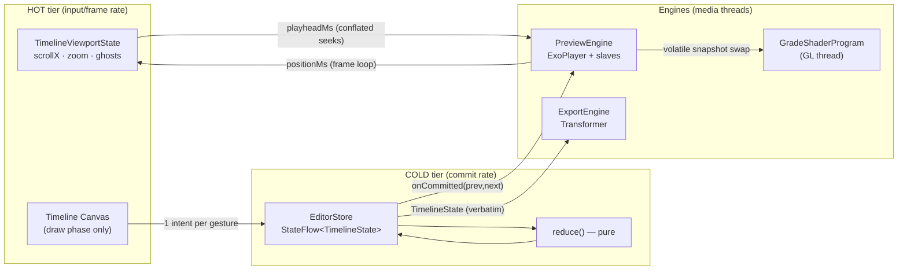

# Kinetic — Native Android Video Editor Blueprint

A production-grade architecture and working code skeleton for a CapCut-class,
hardware-accelerated multi-track video editor built on **Jetpack Compose +
Media3 (ExoPlayer / Transformer / GL effects) + Kotlin Coroutines/StateFlow**
under a strict MVI contract.

## Build and run

```bash
cd kinetic-editor
./gradlew :app:installDebug      # or open the folder in Android Studio and Run
./gradlew :app:testDebugUnitTest # 33 pure-JVM logic tests
```

The Gradle wrapper, launcher icon, theme, ProGuard rules and the film LUT asset
are all committed, so a fresh clone builds and installs with no extra setup.
Code targets **media3 1.8.0** (see [API drift notes](#api-drift-notes)).

**Verification status.** The full source tree parses and front-end-checks clean
under the real Kotlin 2.1.0 compiler, and the serializable model compiles against
the real kotlinx-serialization compiler plugin. androidx symbols were excluded —
Google's Maven was unreachable from the authoring environment — so androidx-facing
call sites are reviewed rather than compiled; everything else is executed. The
pure-logic core (models, reducer, undo store, timeline<->preview mapping, shared
transition/sequence planning math, project codec) compiles verbatim on the JVM and
passes the suite in `app/src/test/java/com/kinetic/editor/CoreLogicTest.kt`.

---

## 1. Architecture: three tiers, two temperatures

The defining problem of a mobile video editor is that three worlds run at
different frequencies and NONE of them may block another:

| World | Frequency | Owner |
|---|---|---|
| Gestures & drawing | 60–120 Hz | Compose (main thread, draw phase) |
| Document mutations | ~1–10 Hz (gesture commits) | MVI store (main thread) |
| Decode / GL / encode | frame rate of media | Media3 internal threads |



### The two-temperature state model (why the UI never stutters)

- **Cold state** — `TimelineState` (tracks → clips → trims/speed/effects) is an
  immutable persistent-collection document inside `EditorStore`. It changes only
  when a gesture **commits** (finger up) or a slider emits a coalesced intent.
  Undo/redo is a stack of these snapshots — structural sharing makes 100 levels
  cost kilobytes (`core/mvi/EditorStore.kt`).
- **Hot state** — scroll, zoom, in-progress trim/drag ghosts live in
  `TimelineViewportState` as Compose snapshot state, read **only in the draw
  phase and pointer handlers**. Scrubbing at 120 Hz mutates two floats and
  re-executes one draw lambda; composition and layout are skipped entirely
  (`ui/timeline/TimelineViewportState.kt`).

A gesture previews its result by merging a *ghost* into the drawn track
(`effectiveTrack()` in `TimelineCanvas.kt` — live ripple included) and dispatches
**exactly one intent** on release. The store is never hammered at input rate.

### Commit routing (the decoupling contract)

`EditorViewModel.route()` grades every commit by how much of the media pipeline
must actually move:

| Change class | Detector | Action | Cost |
|---|---|---|---|
| Cosmetic (grade/LUT/transition/volume/speed/text) | always | volatile FX + segment snapshot swap | ~µs |
| Audio / PiP structure | `audioStructureHash()`, `overlayStructureHash()` | rebuild slave playlists | ms, rare |
| Video structure (trim/reorder/add/remove) | `videoStructureHash()` | rebuild `ConcatenatingMediaSource2`, position-preserving | ~100 ms, rare |

This is why dragging a saturation slider during playback re-renders every frame
with the new value *without touching the player pipeline*: the slider dispatches
coalesced `SetGrade` intents, the store commits, the engine swaps a
`@Volatile PreviewFxTimeline`, and the GL thread picks it up on the next
`drawFrame` — no locks anywhere (`effects/GradeEffects.kt`).

---

## 2. Fluid timeline (`ui/timeline/`)

**One `Canvas` node renders every track.** LazyRows were rejected deliberately:
per-frame item recomposition, entry/exit churn, and N scroll states to sync
during pinch-zoom. Instead:

- Five lanes: main video, PiP video, text, stickers, audio.
- `TimelineGeometry` — pure time↔pixel math + manual hit-testing; reads the
  viewport *at call time* so it's only ever evaluated in draw/gesture phases.
- `TimelineCanvas` — ruler with adaptive tick density, filmstrip thumbnails,
  min/max waveforms, text/sticker chips, selection handles, playhead. New
  thumbnails invalidate **draw only** via a `mutableIntStateOf` revision read
  inside the draw lambda.
- `TimelineGestures` — one `pointerInput` arbitrates scrub-scroll (with decay
  fling), pinch zoom (playhead-anchored), frame-snapped trims, long-press
  drag-reorder with edge auto-scroll and magnetic snapping, and tap-select.
  On a clip body the long-press timer is **raced against the touch slop**
  (`awaitLongPressOrSlop`): move first and you scrub, hold still and you pick
  the clip up. Catching a moving (flung) timeline transfers position ownership
  without dropping a frame, and a gesture that ends where it started commits
  nothing — no phantom undo entries.
- The playhead is **fixed at center; content scrolls beneath it** (CapCut
  model), which makes `scrollX == playheadMs * pxPerMs` an invariant and gives
  playhead-anchored pinch zoom for free.
- Thumbnails (`engine/ThumbnailEngine.kt`): LRU byte-budgeted to heap/6, 1s
  source buckets, pooled `MediaMetadataRetriever` per URI (seek-open cost
  dominates), `OPTION_CLOSEST_SYNC` decode at 256×160. `peek()` is
  allocation-free for the draw loop; prefetch is driven by a `snapshotFlow` of
  the visible window bucketed to 64 px.
- Waveforms (`engine/WaveformEngine.kt`): one-time MediaCodec PCM decode into a
  normalized peak array (~50 buckets/s) on a dedicated single-thread lane.

## 3. Preview sync (`engine/PreviewEngine.kt`)

- The main track plays as **one `ConcatenatingMediaSource2`** (single seekable
  window) of `ClippingConfiguration`-trimmed items — ideal for scrubbing.
- **Two time domains, one mapper.** The window advances in *source* time; the
  editor thinks in *timeline* time (post-speed). `PreviewSegments` is the only
  place the conversion exists, both directions, binary-searched.
- **Frame accuracy:** `SeekParameters.EXACT` + scrubbing mode (media3 1.8) + a
  **one-deep conflated seek queue**: while a seek is in flight, new targets
  overwrite `pendingScrubMs`; `onRenderedFirstFrame` (the "frame actually hit
  the surface" signal) drains it. The decoder is never more than one seek
  behind the finger, regardless of input rate. A 250 ms watchdog covers
  audio-only edge cases.
- **Ownership, not polling**, syncs the scrubber: while playing, a
  `withFrameNanos` loop pushes player position → viewport; while the user (or
  their fling) owns the playhead, a `snapshotFlow` pushes viewport → conflated
  seeks. `isUserInteracting` breaks the feedback loop (`ui/EditorScreen.kt`).
- Per-clip speed and volume envelopes are applied by a 10 Hz control tick in
  preview (`setPlaybackSpeed`, `volume`) — the export applies them
  sample-exactly.
- Overlay audio **and PiP video** tracks play on **slave ExoPlayers** phase-locked
  to the master (re-seek on >80 ms drift). A PiP gets its own `SurfaceView`, laid
  out by Compose from the same `PipSpec` the export compositor uses — so the box
  on screen is the box that renders. Compositing both streams into one GL surface
  just to preview them would cost a full render pass per frame for no visual
  difference. Text/stickers preview as a Compose layer above everything, matching
  the export layer order (compositor first, `OverlayEffect` last).

## 4. Export (`engine/CompositionMapper.kt`, `engine/ExportEngine.kt`)

`TimelineState` → `Composition`, mechanically:

- Main track → primary `EditedMediaItemSequence`; per item: clipping trims,
  the **same GLSL grade/LUT/transition shader as preview** (windows computed in
  clip-local source time, placed *before* `SpeedChangeEffect`), then
  `SonicAudioProcessor(speed)` + `VolumeEnvelopeAudioProcessor` (which runs in
  clip *timeline* time — same domain the keyframes are authored in).
- Each **VIDEO_OVERLAY (PiP) track → its own video sequence**, positioned in
  time by leading gaps and in space by `PipCompositorSettings`, which maps
  compositor input ids (0 = main track, 1..n = overlays) to each track's
  `PipSpec`. The output size is pinned to the composition canvas, so adding a
  PiP can never change the exported frame size.
- Each AUDIO track → an audio-only sequence with `addGap()` silences;
  `experimentalSetForceAudioTrack` guarantees a mixable primary stream.
- TEXT/STICKER tracks → one composition-level `OverlayEffect` with
  alpha-gated, fade-edged windows (composition time == timeline time).
- Composition-level `Presentation.createForWidthAndHeight` fixes the canvas.
- `Transformer` + `DefaultEncoderFactory(VideoEncoderSettings(bitrate))` renders
  hardware-to-hardware; progress is polled into a cold `callbackFlow`;
  `ExportWorker` (WorkManager foreground job) surfaces notification + WorkInfo
  progress and survives the app being backgrounded.

Decode → GL → encode never leaves GPU/codec surfaces, so 4K export memory is
flat by construction — no frame ever exists as a Java `Bitmap`.

## 5. What the editor can actually do

Every feature below is reachable from the UI, previewed live, and rendered by
the exporter — the model, the preview and the export path agree on all three.

| Area | Controls |
|---|---|
| Timeline | pinch zoom, momentum scrub, trim, split at playhead, drag-reorder, delete |
| Clips | speed presets (0.5–4x), per-clip brightness/contrast/saturation, film LUT toggle |
| Transitions | dip-to-black, wipe, zoom-punch on any clip boundary |
| Audio | music and voiceover lanes, per-clip volume, fade in/out, track mute |
| Overlays | text (editable content, size, position), stickers, picture-in-picture with size/position |
| Output | background MP4 export with live progress and the saved filename |

Volume fades deserve a note: the model stores a general keyframe envelope, but
the UI exposes fade-in/fade-out durations, because that is what nearly every
volume edit actually is. `fadeKeyframes`/`readFades` convert between the two, so
the sliders reflect whatever envelope a clip really has.

## 6. Persistence (`core/model/ProjectCodec.kt`)

The document is `@Serializable`, so the whole project round-trips as JSON. Two
behaviours depend on it, and both are correctness features:

- **The export worker is handed a file, not an object.** `ExportWorker` reads the
  project from disk, so a render survives the editor process being killed, and
  enqueuing snapshots the document — the user can keep editing while it renders.
- **The session is restored after process death**, not just after a rotation.
  The editor autosaves on a 700 ms debounce and restores through a `Replace`
  intent that clears undo history rather than letting undo walk into a previous
  session.

Supporting details that matter: `PersistentListSerializer` bridges
kotlinx-collections-immutable (which ships no serializers); saves are atomic
(temp file + rename) so a crash cannot truncate a project; decode fails soft to
`null`, ignores unknown keys (files from a newer version still load) and rejects
structurally impossible documents; and media is picked with `OpenDocument` plus
`takePersistableUriPermission`, because a `GetContent`/photo-picker grant dies
with the process and a restored project could not reopen its own media.

## 7. Performance directives

1. **Defer every hot read to the draw phase.** Scroll/zoom/ghosts are snapshot
   state read inside `Canvas` draw lambdas and pointer handlers only — scrubbing
   skips composition and layout entirely. Where a value must reach composition
   (transport counter), gate it behind `derivedStateOf` so one `Text` recomposes.
2. **Zero allocation on frame paths.** The GL uniform buffer is a reused
   mutable struct; envelope lookup uses struct-of-arrays with a monotonic
   cursor; waveform drawing strides primitives; `peek()` APIs return cached
   `ImageBitmap`s. Objects are only born when a gesture ghost exists.
3. **Lock-free cross-thread handoff.** UI→GL and UI→audio communication is
   "immutable snapshot + volatile swap" (`PreviewFxTimeline`), never shared
   mutable state, never a lock on a render thread.
4. **Budget the decoders.** Thumbnails: 2-lane dispatcher, LRU = heap/6,
   sync-frame-only decode, retriever pool keyed by URI. Waveforms: 1 lane.
   Player: small forward buffer + 3 s keyframe-anchored back buffer so
   short back-scrubs replay from memory; `SurfaceView` (not `TextureView`)
   keeps the decoder zero-copy.
5. **Persistent collections everywhere in the document.** Structural sharing
   makes reducer edits O(changed clips) and undo effectively free — no
   `deepCopy()` GC storms mid-gesture.
6. (Ship-time) Add Baseline Profiles for the editor route, enable R8 +
   resource shrinking (already configured), and consider running export in an
   isolated `:export` process so encoder native heap never fragments the UI
   process.

---

## 8. Project map

```
kinetic-editor/
├── gradlew · gradle/wrapper/ · settings.gradle.kts · build.gradle.kts
├── gradle/libs.versions.toml · app/proguard-rules.pro
└── app/src/
    ├── test/java/com/kinetic/editor/CoreLogicTest.kt   pure-JVM logic suite
    └── main/
    ├── AndroidManifest.xml
    ├── res/                     strings, colors, dark theme, adaptive icon
    ├── assets/luts/             64-cube film LUT (matches the shader layout)
    └── java/com/kinetic/editor/
        ├── core/
        │   ├── model/Models.kt          TimelineState, Track, ClipModel, hashes
        │   ├── model/Planning.kt        shared transition/sequence/fade math
        │   ├── model/ProjectCodec.kt    JSON persistence, atomic save, soft decode
        │   ├── model/MediaProbe.kt      import-time metadata probe
        │   └── mvi/                     EditorIntent, reduce(), EditorStore+undo
        ├── ui/
        │   ├── timeline/                ViewportState, Geometry, Gestures, Canvas
        │   ├── preview/PreviewSurface.kt SurfaceView + Compose overlay layer
        │   ├── EditorViewModel.kt       commit router (the decoupling contract)
        │   └── EditorScreen.kt          sync loops, transport, inspector, tools
        ├── engine/
        │   ├── PreviewEngine.kt         ExoPlayer, segments, conflated seeks, slaves
        │   ├── ThumbnailEngine.kt · WaveformEngine.kt
        │   ├── CompositionMapper.kt     TimelineState -> Composition
        │   └── ExportEngine.kt          Transformer flow + ExportWorker
        ├── effects/
        │   ├── Shaders.kt               shared GLSL (grade/LUT/transitions)
        │   ├── GradeEffects.kt          BaseGlShaderProgram + providers
        │   └── Overlays.kt              timed text/sticker overlays (export)
        └── audio/
            ├── VolumeEnvelopeAudioProcessor.kt
            └── VoiceRecorder.kt         WAV voiceover capture + level meter

app/src/test/  CoreLogicTest (document, planning, codec) +
               TimelineGeometryTest (hit-testing, time<->pixel math)
```

## API drift notes

Pinned to `media3 = 1.8.0`. If you move:

- `ExoPlayer.setScrubbingModeEnabled` — 1.8+. On older versions delete the two
  call sites in `PreviewEngine.setScrubbing`; conflation + `EXACT` still works.
- `StaticOverlaySettings.Builder` (`effects/Overlays.kt`) — 1.6+. On ≤1.5 use
  `OverlaySettings.Builder`.
- `EditedMediaItemSequence.Builder` (`addItem`/`addGap`) — 1.6+. On older
  versions use the list constructors.
- `Composition.Builder.setVideoCompositorSettings` and the
  `VideoCompositorSettings` interface (`effects/PipCompositor.kt`) — 1.4+, and
  the interface has gained methods over time. This is the least-settled surface
  the project touches; if PiP fails to compile, check `getOutputSize` /
  `getOverlaySettings` against your media3 version first.
- Most Transformer/effect surfaces are `@UnstableApi`; the module opts in
  globally via `-opt-in` in `app/build.gradle.kts`.

## Known scope cuts (deliberate, documented)

- **Speed ramps** are modeled as stepped constant-speed segments (split a clip,
  set per-segment speeds) — the same rendering strategy CapCut uses for its
  curve presets. A `SpeedProvider`-based continuous ramp can replace
  `SpeedChangeEffect` later without touching the model.
- **True A/B cross-dissolves** need overlapping streams (compositor); the three
  shipped transitions are single-stream by design and export-identical.
- Trim commits currently snap to whole milliseconds on the source frame grid
  (`snapToFrame`); at 29.97/59.94 fps switch the model to µs if you need
  sub-frame-exact conform.
